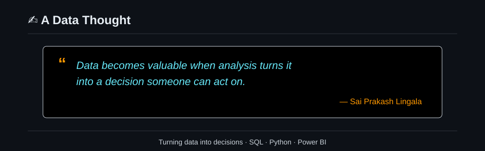

  

  
  

## 👋 Who I Am

I'm Sai Prakash, an aspiring Data Analyst and B.Tech Artificial Intelligence graduate from Anurag University (2022–2026).

I use SQL, Python, and Power BI to turn raw data into clear insights. I enjoy exploring datasets, asking useful questions, and sharing results through analysis and dashboards.

> From raw data to clear insights. From insights to better decisions.

**Open to:** Entry-level Data Analyst roles in Hyderabad and freelance projects.

---

## 🚀 What I'm Working On

- 🔭 Building my data analysis portfolio
- 🌱 Learning advanced SQL, data storytelling, dashboards, and AI
- 👯 Open to collaborating on analysis projects and dashboards
- 💬 Ask me about SQL, Python for data, Power BI, and churn analysis
- ⚡ Fun fact: I love cricket—every match is a dataset

---

## 🧠 Core Technical Strengths

### 📊 Data Analytics
- **Exploratory Data Analysis (EDA)** — Inspecting datasets, finding patterns, and identifying data quality issues
- **SQL & Python** — Querying, cleaning, transforming, and analyzing data
- **Pandas & NumPy** — Preparing and exploring datasets
- **Power BI & Dashboards** — Presenting trends and findings through clear visual reports
- **Excel** — Data cleaning and quick analysis

### ⚙️ Data Engineering
- **ETL** — Extracting, transforming, and loading data for analysis
- **Data Cleaning & Transformation** — Preparing consistent, usable datasets
- **Data Validation** — Checking data quality and consistency during preparation
- **Databricks** — Working with notebooks, data workflows, and AI/BI dashboards

### ☁️ Platforms
- **Databricks** — Notebooks, analytics workflows, and AI/BI dashboards
- **MLflow** — Tracking machine learning experiments and results

### 🤖 AI / ML
- **Churn Analysis** — Exploring customer churn and retention patterns
- **Cohort Analysis** — Comparing retention across customer groups
- **Machine Learning** — Applying ML concepts in data projects

### 🛠️ Developer Tools
- **Git & GitHub** — Version control, project documentation, and publishing work

---

## 📊 Featured Projects

**🛒 Olist E-Commerce Data Analysis**  
Analyzed sales, customer, and delivery performance in Brazilian e-commerce data.  
*SQL · Databricks AI/BI* · [View project](https://github.com/saiprakash-db/olist-ecommerce-data-analysis)

**🎵 Subscription Churn Prediction**  
Explored subscriber churn and cohort retention using a Databricks workflow.  
*Python · Databricks · MLflow · Power BI* · [View project](https://github.com/saiprakash-db/subscription-churn-prediction-databricks)

---

## 🎯 Skills and Expertise

### 🐍 Programming

### 🗄️ Databases

### 📊 Data Analytics

### ⚙️ Data Engineering

### ☁️ Platforms

### 🛠️ Developer Tools

### 🤖 AI / ML

### ✨ Modern AI Stack

---

## 🎓 Education & Certifications

- **B.Tech, Artificial Intelligence** — Anurag University · 2022–2026
- **Deloitte Data Analytics Job Simulation** — Forage
- **SQL and Relational Databases 101** — IBM Skills Network

---

## 🌐 Languages

English · Telugu · Hindi

---

*Turning data into decisions.*

## 💻 Tech Stack

  
  
  
  
  
  
  
  
  
  
  
  
  
  
  
  

<h2 align="center">📊 GitHub Analytics</h2>

  
  

  

